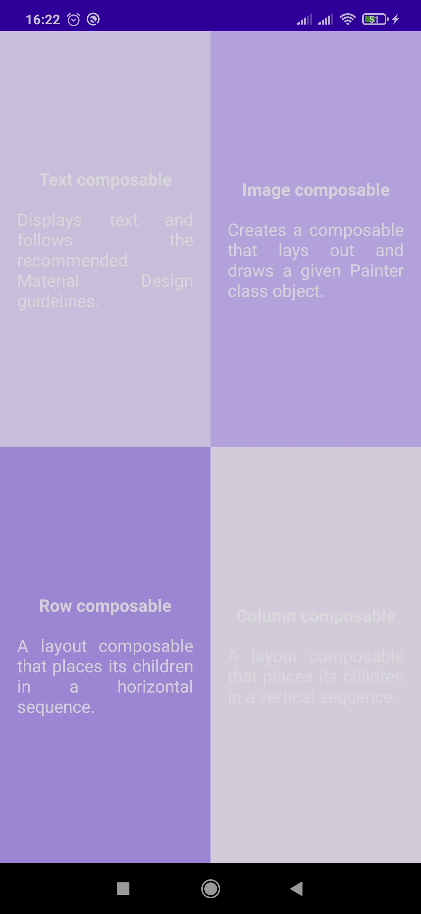

# Repositorio de aprendizagem - [fonte](https://github.com/google-developer-training/basic-android-kotlin-compose-training-practice-problems/tree/main/Unit%201/Pathway%203/ComposeQuadrant)

# Screen

# Kotlin + Compose